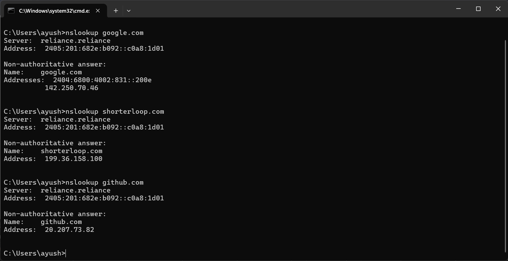
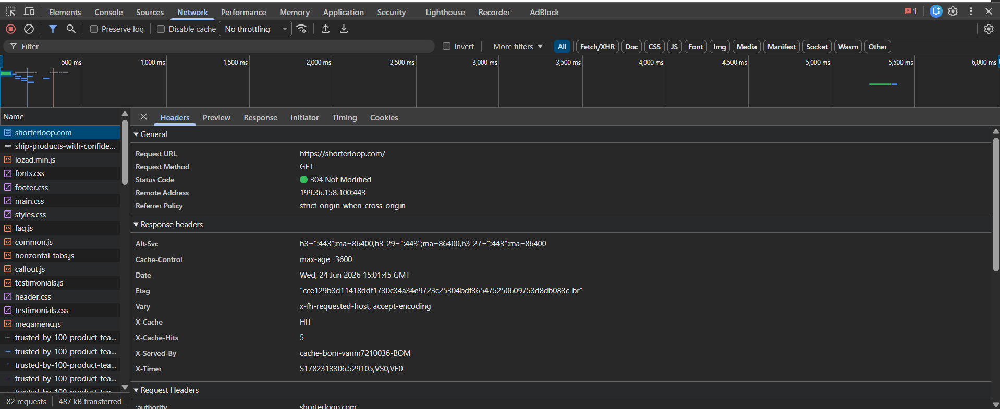
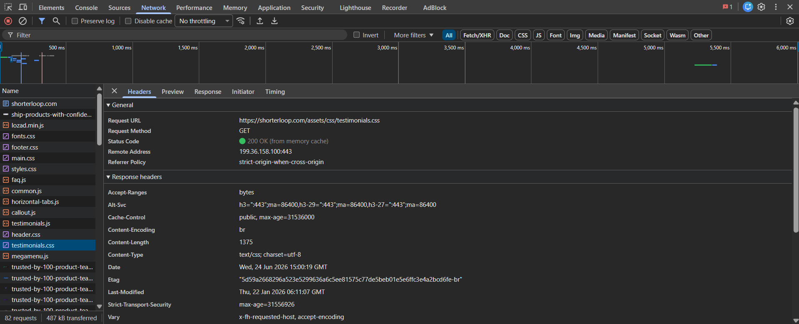
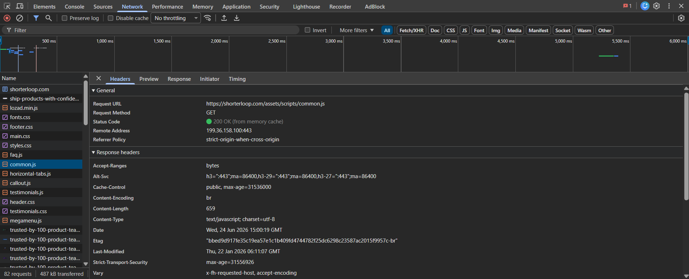

# **How a Website Loads (shorterloop.com)**
## Ever wonder what actually happens when you open a website?
Typing a URL feels instant but it's not — here's everything that actually happens behind the scenes.

1. DNS Lookup My browser only knows the name, not the IP, so it asks DNS to find the real address. I checked this with nslookup shorterloop.com and got 199.36.158.100.

2. TCP Handshake The browser connects to that IP using TCP — a quick back-and-forth to confirm both sides are ready before sending any real data.

3. TLS Handshake Since it's HTTPS, the browser and server also agree on encryption here, so the connection stays secure. That's the lock icon next to the URL.

4. HTTP Request The browser sends a GET request asking for the homepage. I saw this in DevTools as GET https://shorterloop.com/.

5. Server Response The server replies with the HTML and a status code. I mostly saw 200 OK, plus one 304 Not Modified meaning it was already cached.

6. Fetching More Files While reading the HTML, the browser spots links to CSS/JS files and sends separate requests for each — that's why I saw testimonials.css, common.js, etc. in the Network tab.

7. Rendering The browser builds the page structure, applies styles, figures out layout, and paints everything on screen.

## Network Tab Requests — shorterloop.com

### Request 1
URL: https://shorterloop.com/assets/css/testimonials.css
Status: 200 OK (from memory cache)
Type: stylesheet
Header: referrer-policy: strict-origin-when-cross-origin

### Request 2
URL: https://shorterloop.com/assets/scripts/common.js
Status: 200 OK (from memory cache)
Type: script
Header: referrer-policy: strict-origin-when-cross-origin

### Request 3
URL: https://shorterloop.com/assets/css/fonts.css
Status: 200 OK (from memory cache)
Type: stylesheet
Header: referrer-policy: strict-origin-when-cross-origin

### Request 4
URL: https://shorterloop.com/
Status: 200 OK
Type: document
Header: referrer-policy: strict-origin-when-cross-origin

## **Screenshots**

